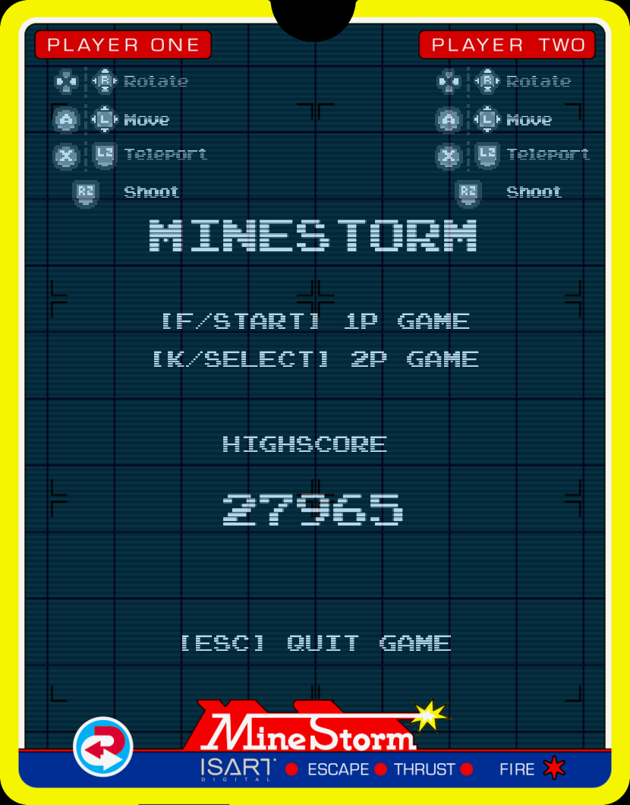

# **MineStorm**

## **General information**

This project is a student project done for ISART Digital by Rémi SERRA and Alexandre PERCHÉ.

The goal was to recreate the "MineStorm" game released on Vectrex in 1982.  
This game can be played with a keyboard or a gamepad, by 1 or 2 players.

The game object assets were provided by the school.  
All keybinding assets come from itch.io free assets packs :

- [Gerald's keys](https://gerald-burke.itch.io/geralds-keys)

- [Kenney's input prompts](https://kenney-assets.itch.io/input-prompts-pixel-16)

 

## **Game information**

When starting a game, a spaceship (the minelayer) lays mines on the playing field.  
These mines then spawn gradually when the player destroys them.  
When all the mines have spawned, the minelayer comes back and lays 3 more mines.  
Finally, when all  the mines have been destroyed and the minelayer is destroyed or gone, the round ends and a new, more difficult one starts.

 

## **Technical details**

The game runs on the simple and easy-to-use [raylib 4.0](https://www.raylib.com/) library made for game programming.  
A custom mathematics library was created for this project. It is mainly used to detect collisions between the game objects' hitboxes.  
Game rendering is done on a render texture, to enable post processing effects, such as scanlines and screen shake.

Upon valgrind inspection, the project leaks and has a few errors. These are all caused by OpenGL and raylib.

 

## **Sound design**

The original soundtrack was composed by Alexandre PERCHÉ.  
[vegasword](https://soundcloud.com/user-131837480-851531639) · [MineStorm Mind](https://soundcloud.com/user-131837480-851531639/minestorm-mind)  

All sound effects come from the [Freesound](https://freesound.org/) website, and are licensed under the Creative Commons Attribution license. Sound effects were also remixed by Alexandre PERCHÉ.  

 

## **Screenshots**

